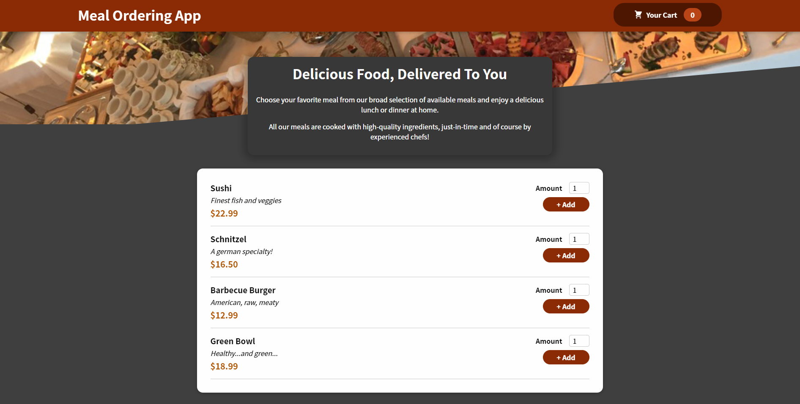
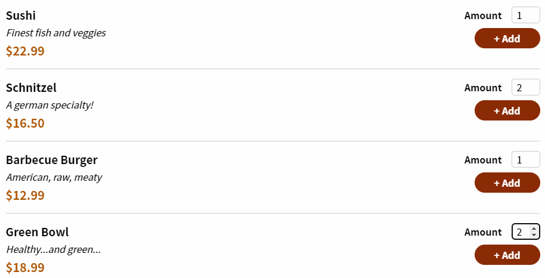
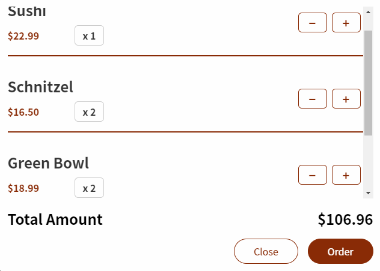

# Food Ordering React App

This project was bootstrapped with [Create React App](https://github.com/facebook/create-react-app).  
This application is still in progress.

[Click Here](https://prem9141.github.io/food-ordering-app/) to see the demo.

## Available Scripts

In the project directory, you can run:

### `npm start`

Runs the app in the development mode.\
Open [http://localhost:3000](http://localhost:3000) to view it in your browser.

### `npm run build`

Builds the app for production to the `build` folder.\
It correctly bundles React in production mode and optimizes the build for the best performance.

The build is minified and the filenames include the hashes.\

## Screenshots

### `Homepage`   

### `Add Food Items to Cart`   

### `Checkout Food Items`   

